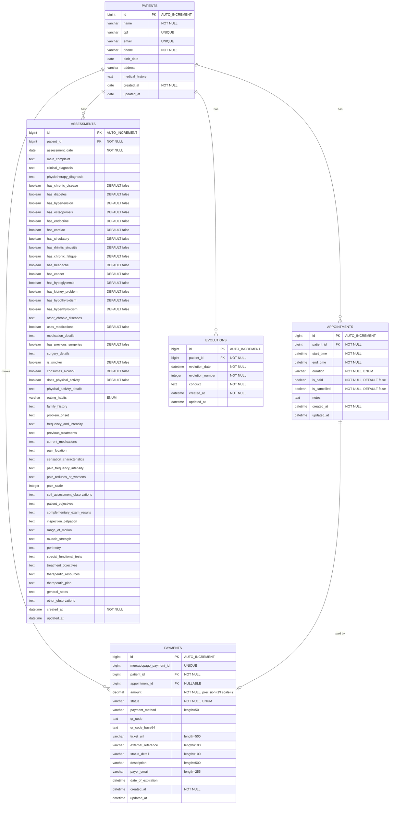

# Database Entity Relationship Diagram (ERD)

## Overview

This document describes the database schema for the Consultorio Fisio application, including all entities, their attributes, relationships, and constraints.

## Entity Relationship Diagram

## Entities

### 1. PATIENTS

**Description**: Core entity representing patients in the physiotherapy clinic.

**Table Name**: `patients`

**Primary Key**: `id` (bigint, auto-increment)

**Columns**:
- `id` (bigint): Unique identifier
- `name` (varchar): Patient's full name (NOT NULL)
- `cpf` (varchar): Brazilian tax ID (UNIQUE)
- `email` (varchar): Email address (UNIQUE)
- `phone` (varchar): Contact phone number (NOT NULL)
- `birth_date` (date): Date of birth
- `address` (varchar): Physical address
- `medical_history` (text): Medical history notes
- `created_at` (date): Record creation timestamp (NOT NULL, auto-populated)
- `updated_at` (date): Last update timestamp (auto-populated)

**Relationships**:
- One-to-Many with APPOINTMENTS
- One-to-Many with ASSESSMENTS
- One-to-Many with EVOLUTIONS
- One-to-Many with PAYMENTS

**Business Rules**:
- CPF and email must be unique across the system
- Name and phone are required fields
- Timestamps are automatically managed

---

### 2. APPOINTMENTS

**Description**: Represents scheduled appointments between patients and the physiotherapist.

**Table Name**: `appointments`

**Primary Key**: `id` (bigint, auto-increment)

**Foreign Keys**:
- `patient_id` references PATIENTS(id)

**Columns**:
- `id` (bigint): Unique identifier
- `patient_id` (bigint): Reference to patient (NOT NULL)
- `start_time` (datetime): Appointment start time (NOT NULL)
- `end_time` (datetime): Appointment end time (NOT NULL, auto-calculated)
- `duration` (varchar): Duration enum - ONE_HOUR (60 min), ONE_HOUR_THIRTY (90 min), TWO_HOURS (120 min) (NOT NULL)
- `is_paid` (boolean): Payment status flag (DEFAULT false)
- `is_cancelled` (boolean): Cancellation status flag (DEFAULT false)
- `notes` (text): Additional notes about the appointment
- `created_at` (datetime): Record creation timestamp (NOT NULL)
- `updated_at` (datetime): Last update timestamp

**Relationships**:
- Many-to-One with PATIENTS
- One-to-One with PAYMENTS (optional)

**Business Rules**:
- `end_time` is automatically calculated based on `start_time` and `duration`
- Default values: `is_paid = false`, `is_cancelled = false`
- Duration must be one of the predefined enum values

**Enum Values**:
- `AppointmentDuration`: ONE_HOUR, ONE_HOUR_THIRTY, TWO_HOURS

---

### 3. ASSESSMENTS

**Description**: Comprehensive patient assessment forms containing medical history, diagnosis, and treatment plans.

**Table Name**: `assessments`

**Primary Key**: `id` (bigint, auto-increment)

**Foreign Keys**:
- `patient_id` references PATIENTS(id)

**Columns** (grouped by category):

#### Basic Information
- `id` (bigint): Unique identifier
- `patient_id` (bigint): Reference to patient (NOT NULL)
- `assessment_date` (date): Date of assessment (NOT NULL)

#### Diagnosis
- `main_complaint` (text): Patient's main complaint
- `clinical_diagnosis` (text): Clinical diagnosis
- `physiotherapy_diagnosis` (text): Physiotherapy-specific diagnosis

#### Chronic Diseases (Boolean flags, all DEFAULT false)
- `has_chronic_disease`: General chronic disease indicator
- `has_diabetes`: Diabetes indicator
- `has_hypertension`: Hypertension indicator
- `has_osteoporosis`: Osteoporosis indicator
- `has_endocrine`: Endocrine disorder indicator
- `has_cardiac`: Cardiac condition indicator
- `has_circulatory`: Circulatory problem indicator
- `has_rhinitis_sinusitis`: Rhinitis/Sinusitis indicator
- `has_chronic_fatigue`: Chronic fatigue indicator
- `has_headache`: Chronic headache indicator
- `has_cancer`: Cancer indicator
- `has_hypoglycemia`: Hypoglycemia indicator
- `has_kidney_problem`: Kidney problem indicator
- `has_hypothyroidism`: Hypothyroidism indicator
- `has_hyperthyroidism`: Hyperthyroidism indicator
- `other_chronic_diseases` (text): Other chronic conditions description

#### Medications & Surgeries
- `uses_medications` (boolean): Medication usage flag (DEFAULT false)
- `medication_details` (text): Details of medications
- `has_previous_surgeries` (boolean): Previous surgery flag (DEFAULT false)
- `surgery_details` (text): Surgery details

#### Lifestyle
- `is_smoker` (boolean): Smoking status (DEFAULT false)
- `consumes_alcohol` (boolean): Alcohol consumption (DEFAULT false)
- `does_physical_activity` (boolean): Physical activity status (DEFAULT false)
- `physical_activity_details` (text): Physical activity description
- `eating_habits` (varchar): Eating habits enum - HEALTHY, MODERATE, POOR
- `family_history` (text): Family medical history

#### Dysfunction History
- `problem_onset` (text): How the problem started
- `frequency_and_intensity` (text): Problem frequency and intensity
- `previous_treatments` (text): Previous treatments received
- `current_medications` (text): Current medication regimen

#### Self-Assessment
- `pain_location` (text): Location of pain
- `sensation_characteristics` (text): Pain sensation characteristics
- `pain_frequency_intensity` (text): Pain frequency and intensity
- `pain_reduces_or_worsens` (text): Factors affecting pain
- `pain_scale` (integer): Pain scale (typically 0-10)
- `self_assessment_observations` (text): Patient's observations

#### Objectives & Exams
- `patient_objectives` (text): Patient's treatment goals
- `complementary_exam_results` (text): Results from complementary exams

#### Physical Examination
- `inspection_palpation` (text): Inspection and palpation findings
- `range_of_motion` (text): Range of motion assessment
- `muscle_strength` (text): Muscle strength evaluation
- `perimetry` (text): Perimetry measurements
- `special_functional_tests` (text): Special functional test results

#### Treatment Planning
- `treatment_objectives` (text): Treatment objectives
- `therapeutic_resources` (text): Therapeutic resources to be used
- `therapeutic_plan` (text): Detailed therapeutic plan

#### Additional Notes
- `general_notes` (text): General notes
- `other_observations` (text): Other observations

#### Audit Fields
- `created_at` (datetime): Record creation timestamp (NOT NULL)
- `updated_at` (datetime): Last update timestamp

**Relationships**:
- Many-to-One with PATIENTS

**Business Rules**:
- All boolean fields default to false
- Comprehensive assessment capturing all aspects of patient condition
- Timestamps automatically managed

**Enum Values**:
- `EatingHabits`: HEALTHY, MODERATE, POOR

---

### 4. EVOLUTIONS

**Description**: Records patient progress and treatment evolution over time.

**Table Name**: `evolutions`

**Primary Key**: `id` (bigint, auto-increment)

**Foreign Keys**:
- `patient_id` references PATIENTS(id)

**Columns**:
- `id` (bigint): Unique identifier
- `patient_id` (bigint): Reference to patient (NOT NULL)
- `evolution_date` (datetime): Date of evolution record (NOT NULL, auto-populated if null)
- `evolution_number` (integer): Sequential number for patient evolutions (NOT NULL)
- `conduct` (text): Treatment conduct and observations (NOT NULL)
- `created_at` (datetime): Record creation timestamp (NOT NULL)
- `updated_at` (datetime): Last update timestamp

**Relationships**:
- Many-to-One with PATIENTS

**Business Rules**:
- `evolution_date` defaults to current timestamp if not provided
- `conduct` is required
- Sequential numbering per patient via `evolution_number`

---

### 5. PAYMENTS

**Description**: Manages payment transactions integrated with Mercado Pago payment gateway.

**Table Name**: `payments`

**Primary Key**: `id` (bigint, auto-increment)

**Foreign Keys**:
- `patient_id` references PATIENTS(id) (NOT NULL)
- `appointment_id` references APPOINTMENTS(id) (NULLABLE)

**Columns**:
- `id` (bigint): Unique identifier
- `mercadopago_payment_id` (bigint): Mercado Pago external payment ID (UNIQUE)
- `patient_id` (bigint): Reference to patient (NOT NULL)
- `appointment_id` (bigint): Optional reference to appointment
- `amount` (decimal): Payment amount with precision 19, scale 2 (NOT NULL)
- `status` (varchar): Payment status enum (NOT NULL)
- `payment_method` (varchar): Payment method, currently always "pix" (length 50)
- `qr_code` (text): PIX QR code string
- `qr_code_base64` (text): Base64 encoded QR code image
- `ticket_url` (varchar): URL to payment ticket (length 500)
- `external_reference` (varchar): External reference ID (length 100)
- `status_detail` (varchar): Detailed status information (length 100)
- `description` (varchar): Payment description (length 500)
- `payer_email` (varchar): Payer's email address (length 255)
- `date_of_expiration` (datetime): Payment expiration date/time
- `created_at` (datetime): Record creation timestamp (NOT NULL)
- `updated_at` (datetime): Last update timestamp

**Relationships**:
- Many-to-One with PATIENTS
- Many-to-One with APPOINTMENTS (optional)

**Business Rules**:
- Integration with Mercado Pago payment gateway
- Supports PIX payment method
- Payment may or may not be linked to an appointment
- Mercado Pago payment ID must be unique
- Timestamps automatically managed

**Enum Values**:
- `PaymentStatus`: PENDING, APPROVED, AUTHORIZED, IN_PROCESS, IN_MEDIATION, REJECTED, CANCELLED, REFUNDED, CHARGED_BACK

---

## Relationships Summary

### One-to-Many Relationships

1. **PATIENTS → APPOINTMENTS**
   - One patient can have multiple appointments
   - Each appointment belongs to exactly one patient
   - Foreign Key: `appointments.patient_id` → `patients.id`

2. **PATIENTS → ASSESSMENTS**
   - One patient can have multiple assessments over time
   - Each assessment belongs to exactly one patient
   - Foreign Key: `assessments.patient_id` → `patients.id`

3. **PATIENTS → EVOLUTIONS**
   - One patient can have multiple evolution records
   - Each evolution belongs to exactly one patient
   - Foreign Key: `evolutions.patient_id` → `patients.id`

4. **PATIENTS → PAYMENTS**
   - One patient can make multiple payments
   - Each payment is made by exactly one patient
   - Foreign Key: `payments.patient_id` → `patients.id`

### Many-to-One (Optional) Relationships

5. **APPOINTMENTS ← PAYMENTS**
   - An appointment may have zero or one associated payment
   - A payment may reference zero or one appointment
   - Foreign Key: `payments.appointment_id` → `appointments.id` (NULLABLE)

---

## Indexes

### Recommended Indexes

**PATIENTS**:
- Primary Key: `id` (auto-indexed)
- Unique: `cpf`, `email`

**APPOINTMENTS**:
- Primary Key: `id` (auto-indexed)
- Foreign Key: `patient_id`
- Composite: `(patient_id, start_time)` for efficient scheduling queries
- Index: `start_time` for date-range queries

**ASSESSMENTS**:
- Primary Key: `id` (auto-indexed)
- Foreign Key: `patient_id`
- Index: `assessment_date`

**EVOLUTIONS**:
- Primary Key: `id` (auto-indexed)
- Foreign Key: `patient_id`
- Composite: `(patient_id, evolution_number)` for sequential numbering
- Index: `evolution_date`

**PAYMENTS**:
- Primary Key: `id` (auto-indexed)
- Unique: `mercadopago_payment_id`
- Foreign Keys: `patient_id`, `appointment_id`
- Index: `status` for filtering by payment status
- Index: `created_at` for date-range queries

---

## Data Types & Constraints

### Common Patterns

**Audit Fields** (present in all entities):
- `created_at`: Auto-populated on insert, immutable
- `updated_at`: Auto-updated on modification

**Boolean Fields**:
- Default to `false` where applicable
- Used for flags and status indicators

**Text Fields**:
- Use `TEXT` type for potentially long content (notes, descriptions, diagnoses)
- Use `VARCHAR` with specific lengths for bounded strings

**Temporal Fields**:
- `DATE`: For birth dates, assessment dates
- `DATETIME`: For appointments, evolutions, payments (includes time component)

---

## Database Technology

- **ORM**: JPA/Hibernate
- **Database**: PostgreSQL/MySQL (configurable)
- **Migration Tool**: Flyway or Liquibase (to be implemented)
- **Connection Pooling**: HikariCP (Spring Boot default)

---

## Notes

1. All entities use `GenerationType.IDENTITY` for auto-increment primary keys
2. Lazy loading is used for `@ManyToOne` relationships to optimize performance
3. All entities include audit fields (`created_at`, `updated_at`) managed via JPA lifecycle callbacks
4. Enum types are stored as strings in the database for readability
5. The schema supports soft deletes if needed in the future (currently using hard deletes)

---

**Last Updated**: 2025-12-01
**Version**: 1.0
**Maintained By**: Development Team
